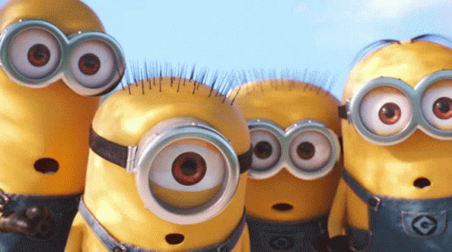

<h1 align="center">📝 Process-video 📝</h1>

 

Projeto em desenvolvimento 🏗️  

  <a href="#-descrição">Descrição</a>&nbsp;&nbsp;&nbsp;|&nbsp;&nbsp;&nbsp;
  <a href="#-tecnologias">Tecnologias</a>&nbsp;&nbsp;&nbsp;|&nbsp;&nbsp;&nbsp;
  <a href="#-projeto">Projeto</a>&nbsp;&nbsp;&nbsp;|&nbsp;&nbsp;&nbsp;
  &nbsp;&nbsp;&nbsp;|&nbsp;&nbsp;&nbsp;

  

 

# 📝 Descrição

Objetivo do projeto final e entrega um algoritmo de processamento de video de forma eficaz fazendo filtros no video
e um possivel processamento em imagem ao vivo 

## 🚀 Tecnologias

## 💻 Projeto
 

  

## 👾Config

  

## 🤝Colaboradores

- Colaboradores que fizeram parte do projeto.
  

     -  [@Luan Medrado](https://github.com/LuanMedrado8)
          
        
 

